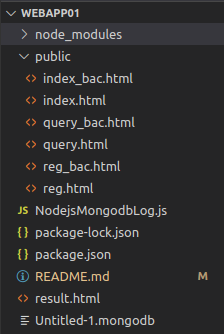

# 190110910634许晨昊 开源软件技术期末作业

## 1）项目设计部分：

（1）项目总体构成；

NodejsMongodbLog.js

index_bac.html

index.html

query_bac.html

query.html

reg_bac.html

reg.html

redeme.md

（2）引入的包在项目中的作用相关说明；

express

轻量化web开发架构

express.session

用于保存登陆信息

（3）项目目录结构和各个部分的说明。

public存放各种静态资源

NodejsMongodbLog.js负责处理网页请求和响应请求

## 2）使用说明书：

每个功能的使用方法

1.登陆：输入正确用户名密码即可登陆

2.注册：输入未注册用户名及重复登录密码即可注册，可通过管理员邀请码成为管理员

3.插入：插入小说信息，仅管理员可用

4.查询：查询小说信息

## 3）开发日记：

12.27制作登陆注册界面

12.28修改文件无法上传到github 搬运项目至webapp01远程库

12.28 update query model

12.28 update query model ver2.0

12.28 update manager model ver 3.0

12.28 update delet model ver 4.0
